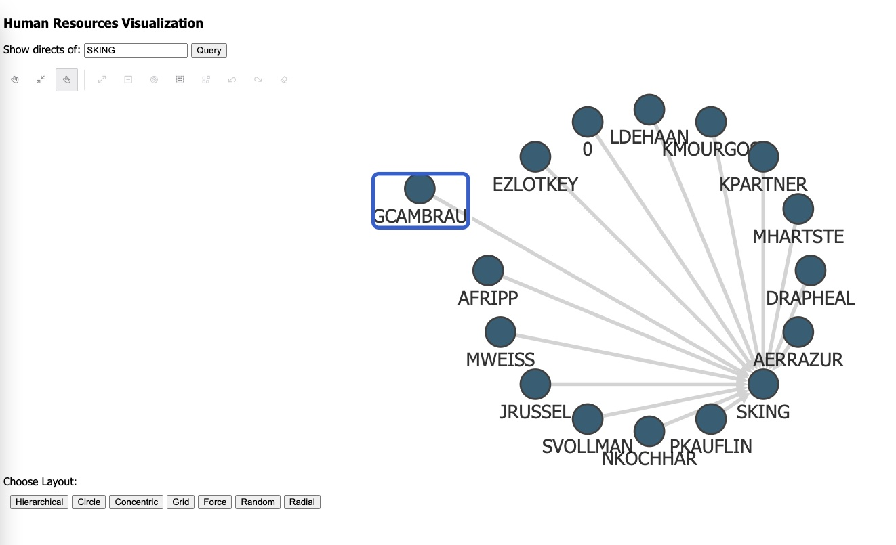

# Oracle Graph Visualization Demo Application 

An example Java web application based on [Micronaut](https://docs.micronaut.io/) which embeds Oracle's Graph
Visualization library. The server queries the graph data from an Oracle Database using 
[PGQL](https://pgql-lang.org/).

The key source files to look at are

* `src/main/resources/public/index.html`: the HTML file served in the browser embedding the visualization library
* `src/main/java/com/oracle/example/HRController.java`: implements the REST endpoints called by `index.html` 
* `src/main/java/com/oracle/example/GraphClient.java`: wraps the graph server APIs, called by HRController


## Pre-requisites

1. Oracle JDK 11 (or OpenJDK 11)
2. A running Oracle Graph Server. Download [from oracle.com](https://www.oracle.com/database/technologies/spatialandgraph/property-graph-features/graph-server-and-client/graph-server-and-client-downloads.html) 
   and install [as per documentation](https://docs.oracle.com/en/database/oracle/property-graph/22.4/spgdg/deploying-graph-visualization-application.html).
3. A running Oracle Database (e.g. [Autonomous Database](https://www.oracle.com/autonomous-database/))
4. This example uses the [Human Resources sample dataset](https://github.com/oracle-samples/db-sample-schemas).
   Import this dataset into your database  [as per instructions on github](https://github.com/oracle-samples/db-sample-schemas).
5. Create a graph out of the dataset using the following statement:

```
CREATE PROPERTY GRAPH myhr
  VERTEX TABLES (
    hr.countries
      KEY ( country_id )
      PROPERTIES ( country_id, country_name, region_id ),
    hr.departments
      KEY ( department_id )
      PROPERTIES ( department_id, department_name, location_id, manager_id ),
    hr.locations
      KEY ( location_id )
      PROPERTIES ( city, country_id, location_id, postal_code, state_province, street_address ),
    hr.dept
      KEY ( deptno )
      PROPERTIES ( deptno, dname, loc ),
    hr.emp
      KEY ( empno )
      PROPERTIES ( comm, deptno, empno, ename, hiredate, job, mgr, sal ),
    hr.jobs
      KEY ( job_id )
      PROPERTIES ( job_id, job_title, max_salary, min_salary ),
    hr.employees
      KEY ( employee_id )
      PROPERTIES ( commission_pct, department_id, email, employee_id, first_name, hire_date, job_id, last_name, manager_id, phone_number, salary ),
    hr.regions
      KEY ( region_id )
      PROPERTIES ( region_id, region_name )
  )
  EDGE TABLES (
    hr.countries AS countries_regions
      SOURCE KEY ( country_id ) REFERENCES countries
      DESTINATION KEY ( region_id ) REFERENCES regions
      NO PROPERTIES,
    hr.departments AS departments_employees
      SOURCE KEY ( department_id ) REFERENCES departments
      DESTINATION KEY ( manager_id ) REFERENCES employees
      NO PROPERTIES,
    hr.departments AS departments_locations
      SOURCE KEY ( department_id ) REFERENCES departments
      DESTINATION KEY ( location_id ) REFERENCES locations
      NO PROPERTIES,
    hr.locations AS locations_countries
      SOURCE KEY ( location_id ) REFERENCES locations
      DESTINATION KEY ( country_id ) REFERENCES countries
      NO PROPERTIES,
    hr.emp AS emp_emp
      SOURCE KEY ( empno ) REFERENCES emp
      DESTINATION KEY ( mgr ) REFERENCES emp
      NO PROPERTIES,
    hr.emp AS emp_dept
      SOURCE KEY ( empno ) REFERENCES emp
      DESTINATION KEY ( deptno ) REFERENCES dept
      NO PROPERTIES,
    hr.employees AS employees_jobs
      SOURCE KEY ( employee_id ) REFERENCES employees
      DESTINATION KEY ( job_id ) REFERENCES jobs
      NO PROPERTIES,
    hr.employees AS employees_departments
      SOURCE KEY ( employee_id ) REFERENCES employees
      DESTINATION KEY ( department_id ) REFERENCES departments
      NO PROPERTIES,
    hr.employees AS employees_employees
      SOURCE KEY ( employee_id ) REFERENCES employees
      DESTINATION KEY ( manager_id ) REFERENCES employees
      NO PROPERTIES
  )
```

You can run this statement using a PGQL client of your choice. If you're using the Autonomous Database, we recommend
to use [Graph Studio](https://docs.oracle.com/en/cloud/paas/autonomous-database/csgru/graph-studio-interactive-self-service-user-interface.html).

On premise, we recommend to use the [PGQL Plug-in for SQLcl](https://docs.oracle.com/en/database/oracle/sql-developer-command-line/20.2/sqcug/using-pgql-plug-sqlcl.html)
or [SQL Developer](https://docs.oracle.com/en/database/oracle/property-graph/22.4/spgdg/property-graph-support-sql-developer1.html).

## Usage

1. Clone this repository 
2. Download the "Oracle Graph Visualization library" [from oracle.com](https://www.oracle.com/database/technologies/spatialandgraph/property-graph-features/graph-server-and-client/graph-server-and-client-downloads.html)
3. Unzip the library into the `src/main/resources/public` directory. For example:

```
unzip oracle-graph-visualization-library-23.1.0.zip -d src/main/resources/public/
```

4. Run the following command to start the example app locally:

```
./gradlew run --args='-oracle.graph-server.url=<graph-server-url> -oracle.graph-server.jdbc-url=<jdbc-url> -oracle.graph-server.username=<username> -oracle.graph-server.password=<password'
```

with

* `<graph-server-url>` being the URL of the Graph Server, e.g. `https://myhost:7007`
* `<jdbc-url>` being the JDBC URL of the Oracle Database the Graph Server should connect to, e.g. `jdbc:oracle:thin:@myhost:1521/orcl` 
* `<username>` being the Oracle Database username to authenticate the example application with the Graph Server, e.g. `scott`
* `<password>` being the Oracle Database password to authenticate the example application with the Graph Server, e.g. `tiger`

Then open your browser at `http://localhost:8080`.

When you click on the <em>Query</em> button, a request is made to `/hr/neighbors`, which fetches the direct reports of 
the given employee (by default `SKING`) from the HR graph using a PGQL query. 



When you right-click on one of the resulting nodes and then select <em>Expand</em>, a request to `/hr/directs` is being 
made, which fetches the neighbors of that node via another PGQL query.

## Troubleshooting

If you get any errors, 
* check the log output from the server on the terminal where the Gradle command is running
* use browser debug tools (e.g. Chrome Developer Tools) to inspect request/response and console logs